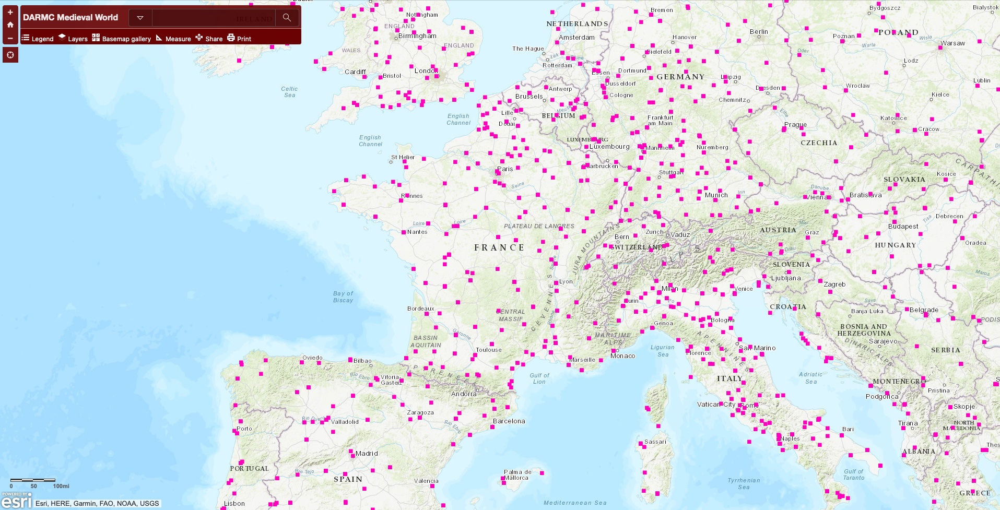
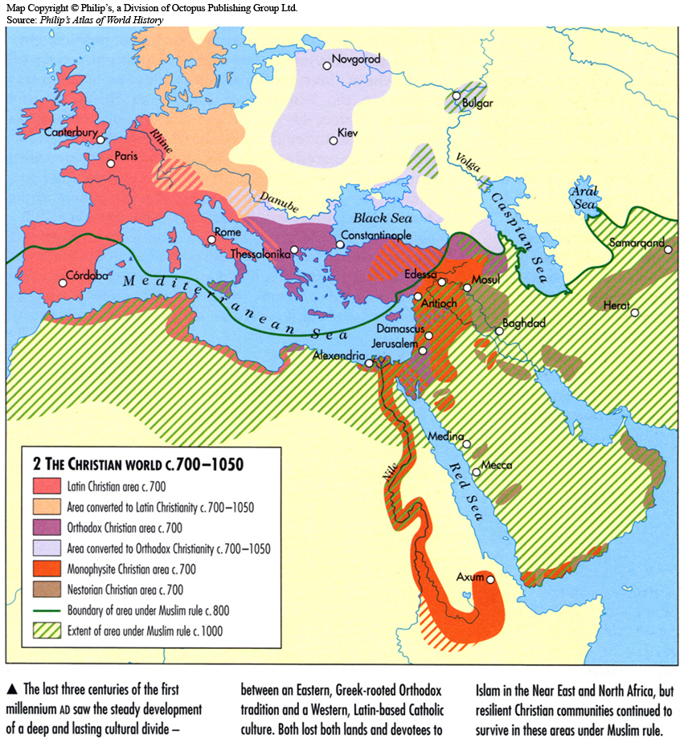

# Maps

If you are looking to find a place or a location, perhaps the best place to start is the [Digital Atlas of Roman and Medieval Civilization](https://arcg.is/1XHyuv). Atop a neutral topographic layer, you can add new layers, showing location of major cities, towns, fairs, dioceses, castles, and it allows you to measure distances between places etc.&#x20;

<figure><figcaption></figcaption></figure>

Another useful site is [https://orbis.stanford.edu](https://orbis.stanford.edu), which is an interactive map of the Roman world, which, among other things, can teach you the Latin names of places, but it also allows you to see how long it would take to get from A to B.&#x20;

<figure><figcaption></figcaption></figure>

Otherwise here are a few useful reference maps:

<figure><figcaption>
From Rosenwein, <em>A short history of the Middle Ages</em>
</figcaption></figure>

<figure><figcaption></figcaption></figure>

<figure><figcaption></figcaption></figure>
